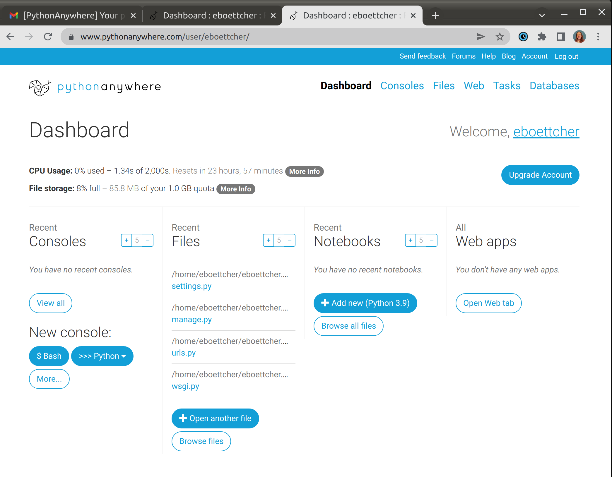
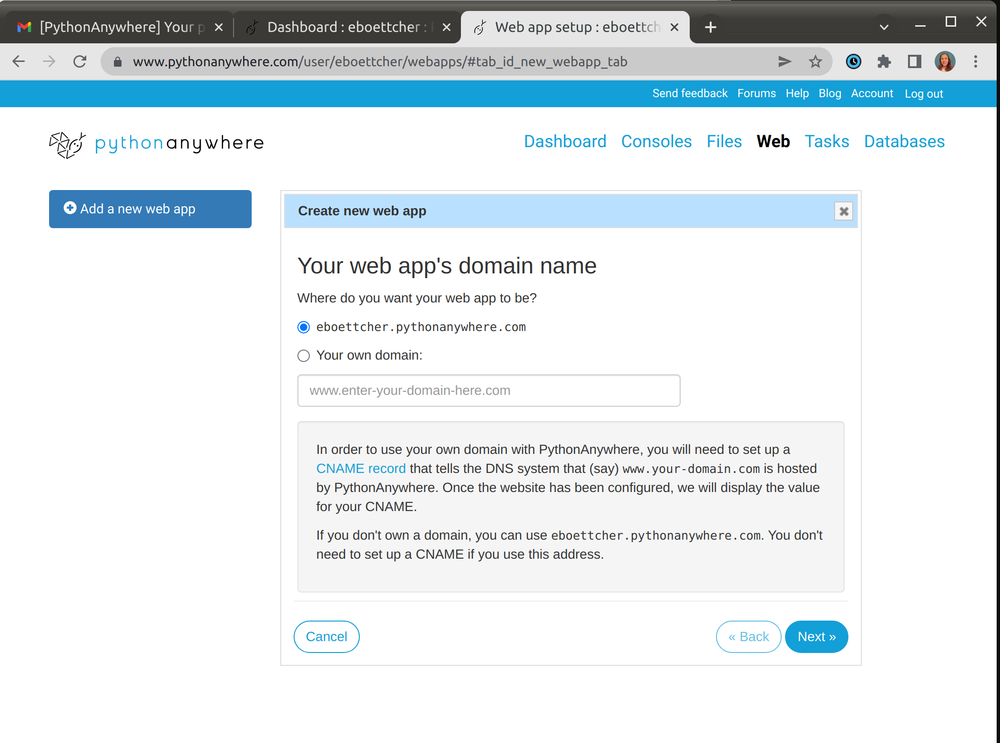
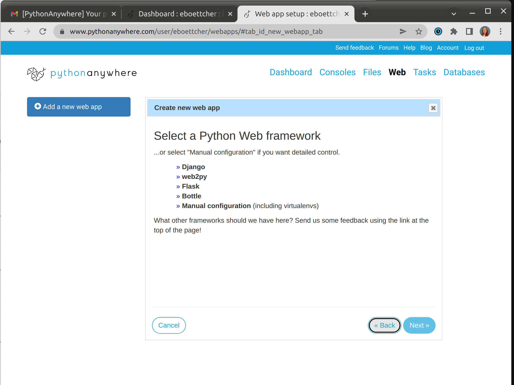
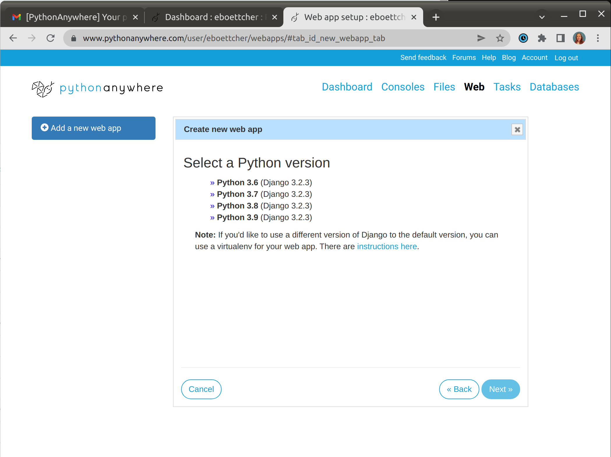
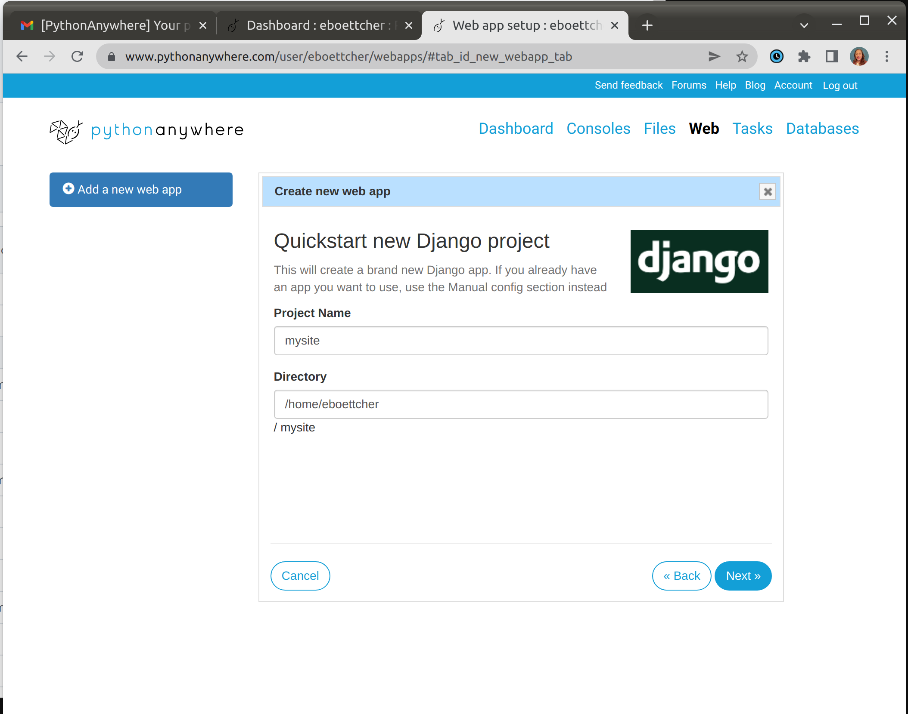

> Part of this section is based on tutorials by Geek Girls Carrots (https://github.com/ggcarrots/django-carrots).

> Part of this section is based on the [django-marcador
tutorial](http://django-marcador.keimlink.de/) licensed under the Creative Commons
Attribution-ShareAlike 4.0 International License. The django-marcador tutorial
is copyrighted by Markus Zapke-Gründemann et al.

## PythonAnywhere
We are going to be building our Django Website directly on [PythonAnywhere](https://www.pythonanywhere.com/).
Typically one works on their own computer, `push`-es to GitHub and then `pull`-s to PythonAnywhere / server site.
That is the work flow most programmers follow.  

But, you can do everything in PythonAnywhere AND all of our steps area 
already saved in this tutorial! So you can go back anytime and re-build your site!
Plus, Pythonanywhere has automated all of the steps below!  


### PythonAnywhere Quick Start Website creation

Go to PythonAnywhere's website and click **Web**


Now click **next.**


Click **Django**



Click Python 3.8 or 3.9


Under Project name, you can put anything you want.
* iamsoawesome
* badassdjangosite
* mysite
* djangogirls

Then click next.


You site is building!  Congratulations.  
But wait, there is not much there and I do not know how to add my blogs!
We will get to that next.

Go to **Your first Django project** if you just built via pythonanywhere.

Else, follow the instructions below if building on your own computer/system.


------------------------------------------------------------

## If working on your own system/ computer.

## Virtual environment

Before we install Django we will get you to install an extremely useful tool to help keep your coding environment tidy on your computer. It's possible to skip this step, but it's highly recommended. Starting with the best possible setup will save you a lot of trouble in the future!

So, let's create a **virtual environment** (also called a *virtualenv*). Virtualenv will isolate your Python/Django setup on a per-project basis. This means that any changes you make to one website won't affect any others you're also developing. Neat, right?

All you need to do is find a directory in which you want to create the `virtualenv`; your home directory, for example. On Windows, it might look like `C:\Users\Name\` (where `Name` is the name of your login).

> __NOTE:__ On Windows, make sure that this directory does not contain accented or special characters; if your username contains accented characters, use a different directory, for example, `C:\djangogirls`.

For this tutorial we will be using your PythonAnywhere home directory, but if you are doing this on your computer create a clean directory by :

command-line

### If on your computer
```
$ mkdir djangogirls
$ cd djangogirls
```

### If working out of PythonAnywhere:
We will be working from your PythonAnywhere's HOME directory.
PythonAnywhere want virtual environments to be in a .virtualenvs folder.

```
mkvirtualenv --python=python3.8 <username>.pythonanywhere.com 

```

We will make a virtualenv called `.virtualenvs/<username>.pythonanywhere.com`. The general command will be in the format:


To activate this environment. 
```bash 
workon <username>.pythonanywhere.com
```


## Working with virtualenv

PythonAnywhere will automatically activate your virtualenv.  But, we need to set that up, which we will do next. 
These instructions are for if you are working on your machine.  We are going to skip this!

The command above will create a directory called `myvenv` (or whatever name you chose) that contains our 
virtual environment (basically a bunch of directories and files).

<!--sec data-title="Working with virtualenv: Windows" data-id="virtualenv_windows"
data-collapse=true ces-->

Start your virtual environment by running:

command-line
```
C:\Users\Name\djangogirls> myvenv\Scripts\activate
```

> __NOTE:__ On Windows 10 you might get an error in the Windows PowerShell that says `execution of scripts is disabled on this system`. In this case, open another Windows PowerShell with the "Run as Administrator" option.  Then try typing the following command before starting your virtual environment:
>
>command-line
>```
>C:\WINDOWS\system32> Set-ExecutionPolicy -ExecutionPolicy RemoteSigned
>     Execution Policy Change
>     The execution policy helps protect you from scripts that you do not trust. Changing the execution policy might expose you to the security risks described in the about_Execution_Policies help topic at http://go.microsoft.com/fwlink/?LinkID=135170. Do you want to change the execution policy? [Y] Yes  [A] Yes to All  [N] No  [L] No to All  [S] Suspend  [?] Help (default is "N"): A
>```

<!-- (This comment separates the two blockquote blocks, so that GitBook and Crowdin don't merge them into a single block.) -->

> __NOTE:__ For users of the popular editor VS Code, which comes with an integrated terminal based off windows PowerShell, if you wish to stick with the integrated terminal, you may run the following command to activate your virtual environment:
>
>```
>$ . myvenv\Scripts\activate.ps1
>```
>The advantage is that you don't have to switch between editor windows and command-line windows


<!--endsec-->

<!--sec data-title="Working with virtualenv: Linux and OS X" data-id="virtualenv_linuxosx"
data-collapse=true ces-->

Start your virtual environment by running:

command-line
```
$ source myvenv/bin/activate
```

Note: (myenv) will now appear one each terminal command line.

Remember to replace `myvenv` with your chosen `virtualenv` name!

> __NOTE:__ If the command `source` is not available, try doing this instead:
>
>command-line
>```
>$ . myvenv/bin/activate
>```

<!--endsec-->

You will know that you have `virtualenv` started when you see that the prompt in your console is prefixed with `(myvenv)`.

When working within a virtual environment, `python` will automatically refer to the correct version so you can use `python` instead of `python3`.

OK, we have all important dependencies in place. We can finally install Django!


## Installing Django {#django}

Now that you have your `virtualenv` started, you can install Django.

Before we do that, we should make sure we have the latest version of `pip`, the software that we use to install Django:

command-line
```
(myvenv) ~$ python -m pip install --upgrade pip
```

### Installing packages with requirements

A requirements file keeps a list of dependencies to be installed using
`pip install`:.   Think of it as the recipe file.

**First:** Create a `requirements.txt` file inside of the `djangogirls/` folder, 
using the code editor that you installed earlier. 

You do this by typing... 

```bash
touch requirements.txt
```

or opening a new file in the code editor and then saving it 
as `requirements.txt` in the `djangogirls/` folder. Your directory will look like this:


```
djangogirls
├── myvenv
│   └── ...
└───requirements.txt
```

**Second:** 

Open the requirements.txt files by,
```bash
nano requirements.txt
````

Add the following in your `djangogirls/requirements.txt` file:

djangogirls/requirements.txt
```
Django~={{ book.django_version }}
```


**Lastly:** Run the requirements.txt by typing `pip install -r requirements.txt` to install Django.

command-line
```
(myvenv) ~$ pip install -r requirements.txt
Collecting Django~={{ book.django_version }} (from -r requirements.txt (line 1))
  Downloading Django-{{ book.django_version }}-py3-none-any.whl (7.9MB)
Installing collected packages: Django
Successfully installed Django-{{ book.django_version }}
```

<!--sec data-title="Installing Django: Windows" data-id="django_err_windows"
data-collapse=true ces-->

> If you get an error when calling pip on Windows, please check if your project pathname contains spaces, accents or special characters (for example, `C:\Users\User Name\djangogirls`). If it does, please consider using another place without spaces, accents or special characters (suggestion: `C:\djangogirls`). Create a new virtualenv in the new directory, then delete the old one and try the above command again. (Moving the virtualenv directory won't work since virtualenv uses absolute paths.)

<!--endsec-->

<!--sec data-title="Installing Django: Windows 8 and Windows 10" data-id="django_err_windows8and10"
data-collapse=true ces-->

> Your command line might freeze when you try to install Django. If this happens, instead of the above command use:
>
>command-line
>```
>C:\Users\Name\djangogirls> python -m pip install -r requirements.txt
>```

<!--endsec-->

<!--sec data-title="Installing Django: Linux" data-id="django_err_linux"
data-collapse=true ces-->

> If you get an error when calling pip on Ubuntu 12.04 please run `python -m pip install -U --force-reinstall pip` to fix the pip installation in the virtualenv.

<!--endsec-->

That's it! You're now (finally) ready to create a Django application!

### Check PythonAnywhere's Virtualenv.

Let's double check our virtualenv in PythonAnywhere.

First, go to the `Dashboard`,
* Click Web
* Scroll to `Virtualenv`

That's it!

If this is the first time you are using pythonanywhere, we need to tell it we want a website.  
